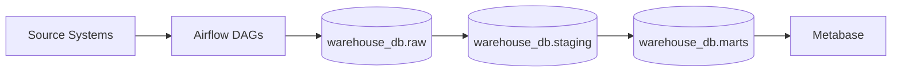

<!--
Purpose: Main project documentation for local ETL stack setup and development.
-->

# ETL Project

## Overview

This project provides a production-aware ETL scaffold using Apache Airflow,
PostgreSQL, and Metabase, fully containerized with Docker Compose.

Detailed documentation and project report can be found in [LAPORAN_ETL.md](LAPORAN_ETL.md).

## Architecture



## Project Structure

```text
etl-project/
├── dags/
│   └── dag_retail_etl_student.py    ← Main ETL Pipeline
├── images/
│   ├── airflow/                     ← Airflow DAG screenshots
│   ├── data_visualisasi/            ← Metabase visualization screenshots
│   └── erd/                         ← OLAP ERD images
├── include/
│   └── sql/
│       └── olap_schema.sql          ← OLAP Star Schema DDL (marts layer)
├── docs/
│   ├── architecture.md
│   ├── data-flow.md
│   └── setup-guide.md
├── tasks/
│   ├── 📚 Tugas — ETL Process.md
│   └── oltp_db_schema.png
├── scripts/
│   ├── init-db.sql                ← Creates databases & mart schemas on first boot
│   └── entrypoint.sh
├── analytical_queries.md            ← Full analytical queries & justification
├── LAPORAN_ETL.md                   ← Project Report (Bahasa Indonesia)
├── Dockerfile
├── docker-compose.yaml
├── .env.example
├── .env
├── .gitignore
├── .dockerignore
├── requirements.txt
├── pyproject.toml
└── README.md
```

## Prerequisites

- Docker >= 24
- Docker Compose v2
- `psql` client (optional — only needed for Method B migration)

## Quick Start

1. Clone repository.
2. Copy environment template: `cp .env.example .env`
3. Fill all required values in `.env`.
4. Set up the local virtual environment (optional but recommended for IDE support):
   ```bash
   python3 -m venv .venv
   source .venv/bin/activate
   pip install -r requirements.txt
   ```
5. Start all services:
   ```bash
   docker compose up --build -d
   ```
6. Run OLAP schema migration (see section below).
7. Configure `OLAP_DB` connection in `dags/dag_retail_etl_student.py`, then trigger the DAG from the Airflow UI.

## Services & Ports

| Service | Port | UI URL | Default Credentials |
|---|---:|---|---|
| Airflow Webserver | 8080 | http://localhost:8080 | From `.env`: `AIRFLOW_ADMIN_USER` / `AIRFLOW_ADMIN_PASSWORD` |
| PostgreSQL | 5432 | n/a | From `.env`: `POSTGRES_USER` / `POSTGRES_PASSWORD` |
| Metabase | 3000 | http://localhost:3000 | Created in Metabase setup wizard |

## Database Schemas

Warehouse data (`warehouse_db`) follows a three-layer model:

| Schema | Layer | Purpose |
|---|---|---|
| `raw` | Landing | Source-aligned records, no transformation |
| `staging` | Intermediate | Cleaned and validated data |
| `marts` | Business-ready | Star Schema OLAP tables for analytics |

Detailed analytical queries and schema justification can be found in [analytical_queries.md](analytical_queries.md).


```
DIMENSIONS                       FACTS
──────────────────────────────   ─────────────────────────────────────────
dim_date          (kalender)  ←─ fact_sales   (grain: 1 order item)
dim_category      (kategori)  ←─ fact_payment (grain: 1 transaksi)
dim_product       (produk)    ←─ fact_review  (grain: 1 ulasan produk)
dim_customer      (pelanggan)
dim_payment_method(metode)
dim_campaign      (kampanye)
```

## OLAP Schema Migration

Jalankan migration **setelah** `docker compose up` selesai dan PostgreSQL healthy.
Script DDL ada di `include/sql/olap_schema.sql`.

### Langkah 0 — Load environment variables dari `.env`

```bash
export $(grep -v '^#' .env | xargs)
```

> Langkah ini wajib dilakukan sebelum menjalankan Method B agar variabel
> `POSTGRES_USER` dan `POSTGRES_PASSWORD` tersedia di shell lokal.
> (Untuk Method A, variabel sudah otomatis terbaca dari container).

---

### Method A — Via Docker exec *(direkomendasikan, tidak perlu psql lokal)*

```bash
docker exec -i etl-postgres \
    sh -c 'psql -U "$POSTGRES_USER" -d warehouse_db' \
    < include/sql/olap_schema.sql
```

---

### Method B — Via psql client lokal

```bash
PGPASSWORD="$POSTGRES_PASSWORD" psql \
    -h localhost \
    -p 5432 \
    -U "$POSTGRES_USER" \
    -d warehouse_db \
    -f include/sql/olap_schema.sql
```

---

### Verifikasi — Pastikan semua tabel berhasil dibuat

```bash
docker exec -it etl-postgres \
    sh -c 'psql -U "$POSTGRES_USER" -d warehouse_db -c "\dt marts.*"'
```

Output yang diharapkan:

```
             List of relations
 Schema |        Name        | Type  |   Owner
--------+--------------------+-------+-----------
 marts  | dim_campaign       | table | etl_admin
 marts  | dim_category       | table | etl_admin
 marts  | dim_customer       | table | etl_admin
 marts  | dim_date           | table | etl_admin
 marts  | dim_payment_method | table | etl_admin
 marts  | dim_product        | table | etl_admin
 marts  | fact_payment       | table | etl_admin
 marts  | fact_review        | table | etl_admin
 marts  | fact_sales         | table | etl_admin
(9 rows)
```

Verifikasi seed data `dim_payment_method`:

```bash
docker exec -it etl-postgres \
    sh -c 'psql -U "$POSTGRES_USER" -d warehouse_db -c "SELECT method_sk, method_code, method_name, is_digital FROM marts.dim_payment_method;"'
```

---

### Reset Migration *(drop & re-create semua tabel OLAP)*

> ⚠️ Peringatan: perintah ini menghapus semua data di schema `marts`.

```bash
docker exec -i etl-postgres \
    sh -c 'psql -U "$POSTGRES_USER" -d warehouse_db' << 'EOF'
-- Drop facts first (karena FK ke dimensions)
DROP TABLE IF EXISTS marts.fact_review   CASCADE;
DROP TABLE IF EXISTS marts.fact_payment  CASCADE;
DROP TABLE IF EXISTS marts.fact_sales    CASCADE;

-- Drop dimensions
DROP TABLE IF EXISTS marts.dim_campaign        CASCADE;
DROP TABLE IF EXISTS marts.dim_payment_method  CASCADE;
DROP TABLE IF EXISTS marts.dim_customer        CASCADE;
DROP TABLE IF EXISTS marts.dim_product         CASCADE;
DROP TABLE IF EXISTS marts.dim_category        CASCADE;
DROP TABLE IF EXISTS marts.dim_date            CASCADE;

\echo 'Semua tabel OLAP berhasil dihapus.'
EOF
```

Setelah reset, jalankan kembali migrasi dengan Method A atau Method B di atas.

---

## DAG Development

- Add DAG files under `dags/`.
- Add SQL helpers under `include/sql/` and schema files under `include/schemas/`.
- Airflow auto-detects DAG changes from mounted volumes, so restart is not required
	for most file edits.
- Pastikan `OLAP_DB` di `dags/dag_retail_etl_student.py` sudah diisi dengan
  koneksi ke `warehouse_db` sebelum menjalankan DAG.

## Troubleshooting

- PostgreSQL healthcheck stays unhealthy:
  ```bash
  docker compose logs postgres
  ```
- Migration gagal dengan error `schema "marts" does not exist`:
  ```bash
  # Schema marts dibuat oleh init-db.sql saat postgres pertama kali dijalankan.
  # Jika belum ada, jalankan ulang dengan volume baru:
  docker compose down -v && docker compose up --build -d
  ```
- Reinitialize clean local state:
  ```bash
  docker compose down -v && docker compose up --build
  ```
- Airflow admin user was not created:
  ```bash
  docker compose run --rm airflow-init
  ```
- Verify environment values loaded correctly:
  ```bash
  docker compose config
  ```

## Contributing

Follow the pull request template at
[.github/PULL_REQUEST_TEMPLATE.md](.github/PULL_REQUEST_TEMPLATE.md).