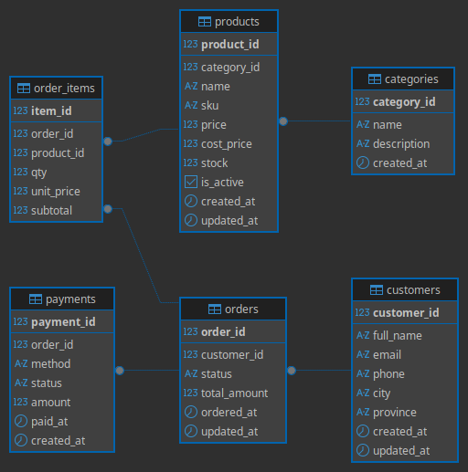

# **📚 Tugas — ETL Process**

**Mata Kuliah:** Data Warehouse & Data Mining

---

## **Konteks**

Anda telah diberikan **OLTP database** sistem retail sederhana dengan 6 tabel:

customers ──\< orders ──\< order\_items \>── products \>── categories  
                 │  
               payments

Pipeline Airflow juga mengambil data dari **2 sumber eksternal**:

* `api_product_reviews.csv` — data ulasan produk dari platform review (via API)  
* `promotions.csv` — data kampanye marketing (via storage)

---

## **Tugas**

### **Bagian A — Desain OLAP Schema**

Rancang **Star Schema** atau **Snowflake Schema** untuk menjawab ketiga pertanyaan bisnis di bawah ini.

Deliverable:

1. **ERD OLAP** (boleh di draw.io, dbdiagram.io, atau tulisan tangan yang difoto)  
2. **DDL SQL** untuk semua tabel dimensi dan fakta yang Anda rancang  
3. **Justifikasi** singkat (1–2 paragraf): mengapa Anda memilih star vs snowflake, dan bagaimana tabel dari sumber eksternal (reviews, promotions) diintegrasikan

---

### **Bagian B — Query Analitik**

Tuliskan **query SQL** untuk menjawab masing-masing pertanyaan bisnis berikut. Query ditulis terhadap **schema OLAP yang Anda rancang** (bukan OLTP).

---

## **Pertanyaan Bisnis**

---

### **Pertanyaan 1 — Tren Revenue & Margin per Kategori Produk**

**"Berapa total revenue dan gross margin per kategori produk, dikelompokkan per bulan? Kategori mana yang paling profitable dan apakah ada tren penurunan margin di bulan-bulan tertentu?"**

**Yang harus dijawab query Anda:**

* Total revenue (`qty × unit_price`) per kategori per bulan  
* Gross margin (`revenue - (qty × cost_price)`) per kategori per bulan  
* Persentase margin (`gross_margin / revenue × 100`)  
* Urutkan dari margin tertinggi ke terendah

---

### **Pertanyaan 2 — Segmentasi Pelanggan & Metode Pembayaran Favorit**

**"Siapa 5 pelanggan dengan total transaksi (paid) tertinggi? Dari kota/provinsi mana mereka berasal, dan metode pembayaran apa yang paling sering mereka gunakan? Apakah ada korelasi antara nilai transaksi dan pilihan metode pembayaran?"**

**Yang harus dijawab query Anda:**

* Ranking pelanggan berdasarkan total `amount` dengan status `paid`  
* Asal kota dan provinsi pelanggan  
* Metode pembayaran yang paling sering digunakan per pelanggan  
* Jumlah order dan rata-rata nilai order per pelanggan

---

### **Pertanyaan 3 — Efektivitas Kampanye Marketing terhadap Rating Produk**

**"Apakah produk dalam kategori yang sedang mendapat promo aktif memiliki rata-rata rating ulasan yang lebih tinggi dibandingkan produk tanpa promo? Kampanye mana yang paling berkorelasi dengan kategori produk berperforma baik di ulasan pelanggan?"**

**Yang harus dijawab query Anda:**

* Rata-rata rating (`avg_rating`) per kategori  
* Status kampanye aktif pada periode yang sama (`is_active = true`)  
* Perbandingan avg rating: kategori **dengan promo aktif** vs **tanpa promo aktif**  
* List kampanye beserta kategori target dan avg rating produknya

---
